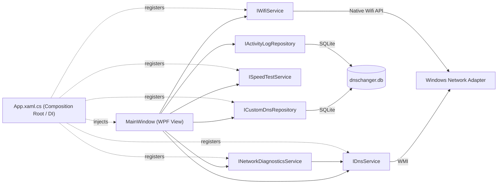

<div align="center">

# 🌐 DNS Changer

**A modern Windows desktop utility for switching DNS servers instantly — with automatic connection diagnostics, live speed testing, and Wi-Fi management.**

Built with WPF, .NET 8, SQLite, and a clean layered architecture.


[Features](#-features) • [Architecture](#-architecture) • [Getting Started](#-getting-started) • [Roadmap](#-roadmap) • [Author](#-author)

</div>

---

## 📖 Overview

DNS Changer is a desktop tool that goes beyond switching DNS servers: it diagnoses and automatically repairs common connectivity problems, tests real network speed, manages nearby Wi-Fi networks, and keeps a full activity log — all from a single, themeable, multi-page interface, running quietly from the system tray when not in use.

Rather than being a quick single-file script, the project is deliberately structured the way a production application would be: UI and business logic are separated, dependencies are injected, data is persisted in SQLite, and the codebase is built to be testable and extendable.

## ✨ Features

- ⚡ **One-click DNS switching**, with all providers (built-in and user-added) stored in SQLite and managed from a single list — add, apply, or delete any entry
- 🔍 **Automatic adapter detection** — finds the active Wi-Fi/Ethernet interface, no manual setup
- 🛠 **Custom automatic diagnostics engine** — checks the connection layer by layer (adapter → gateway → raw internet → DNS resolution), tests multiple domains to avoid false positives from a single filtered host, falls back through several known-good DNS providers automatically, and retries an adapter restart if the router is unreachable — built from scratch rather than shelling out to Windows' own troubleshooter
- 📶 **Per-server ping check** and **live Wi-Fi network scanning** (signal strength, security type)
- 🚀 **Real speed test** — download, upload, ping, and jitter, streamed live with an animated gauge and a rolling fluctuation chart, plus automatic data-center detection
- 📜 **Full activity log** — every DNS change, cache flush, adapter restart, and diagnostic run is recorded and viewable, with a one-click clear
- 🎨 **Dark/light theme with 7 selectable accent colors**, persisted across restarts, plus custom-styled dialogs to match (no default Windows message boxes)
- 🧭 **Multi-page navigation UI** (DNS, Troubleshoot, Speed Test, Wi-Fi, History, Settings) with a right-to-left Persian interface
- 🖥 **System tray integration** — closes to the tray instead of quitting, quick access from a tray context menu
- 🔐 **Administrator-privilege detection** before any network change is applied

### Coming soon
- [ ] Connecting to Wi-Fi networks (scanning is live; connecting, including password entry, is next)
- [ ] Full UI localization (Persian/English toggle)
- [ ] Unit test coverage for the service layer
- [ ] Android companion app (.NET MAUI)

## 🏗 Architecture



```
DnsChanger/
├── Models/          # Plain data models (DnsProvider, CustomDnsEntry, DiagnosticStepResult,
│                     #   SpeedTestResult/Progress, WifiNetworkInfo, ActivityLogEntry)
├── Services/        # Business logic: DnsService (WMI), NetworkDiagnosticsService,
│                     #   SpeedTestService, WifiService, PingService
├── Repository/       # CustomDnsRepository, ActivityLogRepository — SQLite data access
├── Data/            # DatabaseInitializer — schema + default DNS seeding
├── App.xaml.cs       # Composition root: configures DI, app-wide theme resources, starts the app
├── CustomDialog.xaml  # Themed replacement for MessageBox (success/error/warning/question)
└── MainWindow.xaml   # UI only — delegates all logic to injected services
```

**Key design decisions:**
| Decision | Why |
|---|---|
| Service interfaces (`IDnsService`, `ICustomDnsRepository`, `INetworkDiagnosticsService`, `ISpeedTestService`, `IWifiService`) | Decouples the UI from implementation details; makes each layer mockable for unit tests |
| Dependency Injection (`Microsoft.Extensions.DependencyInjection`) | Same DI container used across the ASP.NET Core ecosystem — no hidden `new` calls inside the UI layer |
| SQLite with parameterized queries | Local, zero-install storage; parameters prevent SQL injection |
| Custom diagnostics instead of launching Windows' troubleshooter | Full control over the fix logic (multi-domain checks, DNS fallback chain, adapter restart) instead of a generic black-box wizard |
| Streamed speed test (chunked download/upload) | Reports real-time throughput instead of a single number at the end |
| Theme resources at `Application` scope | Lets every window — including dialogs — share and live-update the same theme |

## 🛠 Tech Stack

| Category | Technology |
|---|---|
| Language | C# |
| Framework | .NET 8, WPF |
| Network access | WMI (`System.Management`), `System.Net.NetworkInformation`, `System.Net.Http` |
| Wi-Fi | Native Wifi API via `ManagedNativeWifi` |
| Local storage | SQLite (`Microsoft.Data.Sqlite`) |
| Dependency Injection | `Microsoft.Extensions.DependencyInjection` |
| Settings persistence | JSON (`System.Text.Json`) |
| System tray | `System.Windows.Forms.NotifyIcon` |

## 🚀 Getting Started

### Prerequisites
- Windows 10 or 11
- [.NET 8 SDK](https://dotnet.microsoft.com/download)
- Visual Studio 2022 (recommended) or the `dotnet` CLI

### Build & Run
```bash
git clone https://github.com/AlirezaHadian/DnsChanger.git
cd DnsChanger
dotnet build
```

> ⚠️ Run the application **as Administrator** — modifying network adapter DNS settings requires elevated permissions on Windows.

## 🗺 Roadmap

- [x] Layered architecture with dependency injection
- [x] SQLite-backed DNS list (built-in + custom, unified) and activity log
- [x] Custom automatic network diagnostics and repair
- [x] Dark/light theming with persistence, custom-styled dialogs
- [x] Real speed test with live gauge, jitter, and fluctuation chart
- [x] Live Wi-Fi network scanning
- [x] System tray integration
- [ ] Connecting to Wi-Fi networks
- [ ] Full UI localization
- [ ] Unit test coverage
- [ ] Android companion app (.NET MAUI)

## 🤝 Contributing

This is primarily a personal/portfolio project, but issues and suggestions are welcome — feel free to open an issue or submit a pull request.

## 📄 License

Licensed under the [MIT License](LICENSE).

## 👤 Author

**Alireza Hadian** — .NET Developer

[](https://github.com/AlirezaHadian)
[](https://www.linkedin.com/in/alirezahadian)

