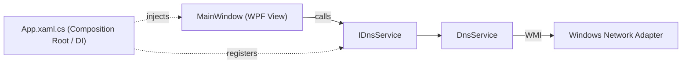

<div align="center">

# 🌐 DNS Changer

**A modern Windows desktop utility for switching DNS servers instantly.**

Built with WPF, .NET 8, and a clean layered architecture.


[Features](#-features) • [Architecture](#-architecture) • [Getting Started](#-getting-started) • [Roadmap](#-roadmap) • [Author](#-author)

</div>

---

## 📖 Overview

DNS Changer is a lightweight desktop tool that lets users switch their network adapter's DNS servers in one click — no more digging through Windows network settings. It automatically detects the active adapter (Wi-Fi or Ethernet), applies the change instantly, and can restore automatic (DHCP) DNS just as easily.

Rather than being a quick single-file script, the project is deliberately structured the way a production application would be: UI and business logic are separated, dependencies are injected rather than hard-coded, and the codebase is built to be testable and extendable.

## ✨ Features

- ⚡ **One-click DNS switching** between built-in providers (Shecan, Bogzar, Host Iran, 403 Online)
- 🔍 **Automatic adapter detection** — finds the active Wi-Fi/Ethernet interface, no manual setup
- ↩️ **One-click reset** back to automatic (DHCP) DNS
- 🔐 **Administrator-permission check** before any network change is applied
- 🧱 **Layered architecture** — UI, business logic, and data access are fully separated

## 🏗 Architecture

The codebase follows a simple, explicit layering so that no single file mixes UI code with business logic:



```
DnsChanger/
├── Models/          # Plain data models (e.g. DnsProvider)
├── Services/        # Business logic (IDnsService / DnsService) — talks to WMI
├── App.xaml.cs       # Composition root: configures DI and starts the app
└── MainWindow.xaml   # UI only — delegates all DNS logic to IDnsService
```

**Key design decisions:**
| Decision | Why |
|---|---|
| `IDnsService` interface + `DnsService` implementation | Decouples the UI from the DNS-switching mechanism; makes the logic mockable for unit tests |
| Dependency Injection (`Microsoft.Extensions.DependencyInjection`) | Same DI container used across the ASP.NET Core ecosystem — no hidden `new` calls inside the UI layer |
| WMI (`System.Management`) over `netsh` shell calls | Type-safe, no shell parsing, works reliably across Windows versions |

## 🛠 Tech Stack

| Category | Technology |
|---|---|
| Language | C# |
| Framework | .NET 8, WPF |
| Network access | WMI (`System.Management`) |
| Dependency Injection | `Microsoft.Extensions.DependencyInjection` |
| Local storage *(in progress)* | SQLite |

## 🚀 Getting Started

### Prerequisites
- Windows 10 or 11
- [.NET 8 SDK](https://dotnet.microsoft.com/download)
- Visual Studio 2022 (recommended) or the `dotnet` CLI

### Build & Run
```bash
git clone https://github.com/AlirezaHadian/DnsChanger.git
cd DnsChanger
dotnet build
```

> ⚠️ Run the application **as Administrator** — modifying network adapter DNS settings requires elevated permissions on Windows.

## 🗺 Roadmap

- [ ] Custom DNS profiles, persisted locally with SQLite
- [ ] DNS change history log
- [ ] Ping/latency test to auto-select the fastest server
- [ ] DNS-over-HTTPS (DoH) support
- [ ] Redesigned dark-theme UI
- [ ] Unit test coverage for the service layer
- [ ] Android companion app (.NET MAUI)

## 🤝 Contributing

This is primarily a personal/portfolio project, but issues and suggestions are welcome — feel free to open an issue or submit a pull request.

## 📄 License

Licensed under the [MIT License](LICENSE).

## 👤 Author

**Alireza Hadian** — .NET Developer

[](https://github.com/AlirezaHadian)
[](https://www.linkedin.com/in/alirezahadian)

